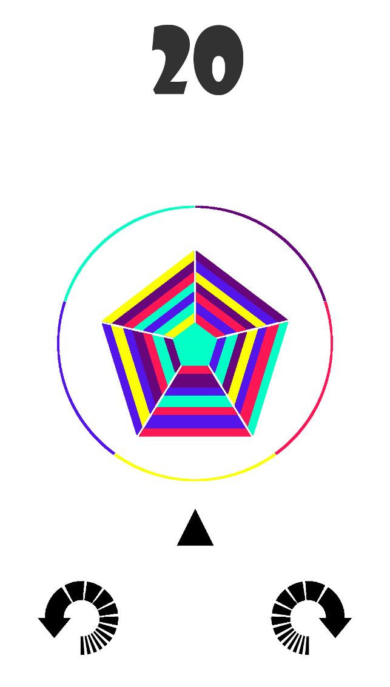

# Polycolorbital
A mobile tap game made with Unity

 

Objective: 
- Eliminate the growing Colorblob as quickly as possible. As your ship orbits around the ColorShield you must shoot through the correct color to hit and destroy the colorblob. 
- If you hit it with the wrong color the blob will grow bigger. 
- If the blob reaches and breaks the colorshield you lose.

To-Do: 
- Add new random colorblob polygon enemies
- Some colorblobs can have multiple polygons
